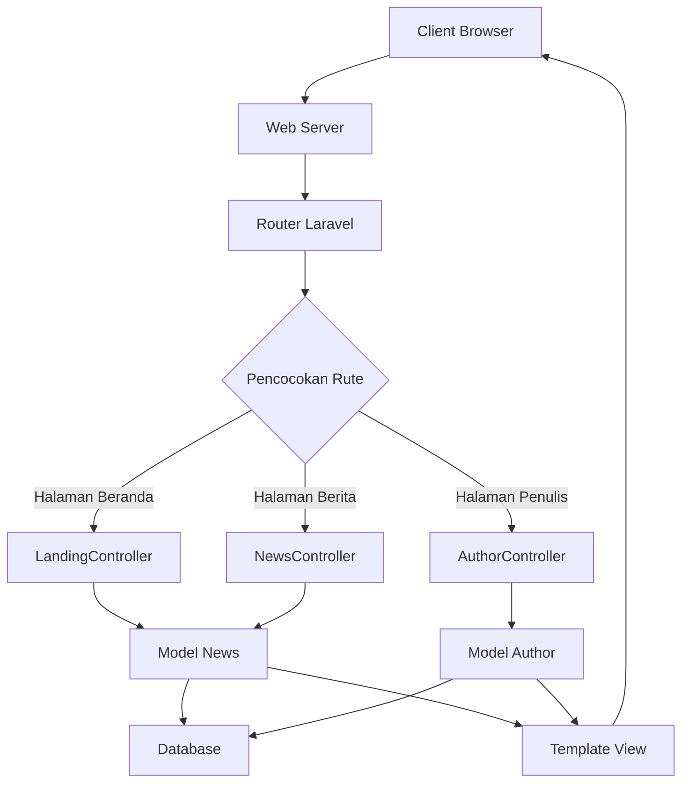
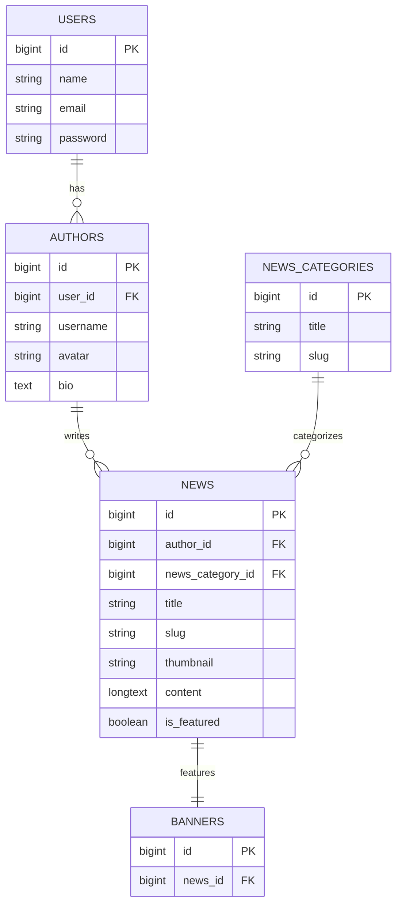

# Gambaran Teknis

## Arsitektur Sistem

Maos mengikuti pola arsitektur Model-View-Controller (MVC) standar yang diimplementasikan dengan framework PHP Laravel.

### Arsitektur Tingkat Tinggi

```
[Client/Browser]
        ↓
[Web Server (Apache/Nginx)]
        ↓
[Aplikasi Laravel]
        ↓
[Database (MySQL)]
```

### Diagram Komponen



## Alur Data

### 1. Pemrosesan Permintaan
1. Pengguna meminta halaman melalui browser
2. Web server merutekan permintaan ke aplikasi Laravel
3. Router Laravel mencocokkan URL dengan rute yang didefinisikan
4. Method controller yang sesuai dipanggil
5. Controller berinteraksi dengan model untuk mengambil data
6. Data dikirim ke template view
7. View dirender sebagai respons HTML
8. Respons dikirim kembali ke browser pengguna

### 2. Hubungan Database



## Komponen Teknis Utama

### 1. Model dan Hubungan

#### Model News
- Entitas primer yang mewakili artikel
- Milik Author dan NewsCategory
- Memiliki satu Banner (status unggulan)
- Termasuk accessor URL thumbnail

#### Model Author
- Mewakili pembuat konten
- Milik User
- Memiliki banyak artikel News
- Termasuk accessor URL avatar dengan fallback

#### Model NewsCategory
- Mengkategorikan artikel berita
- Memiliki banyak artikel News

#### Model Banner
- Mewakili berita unggulan di beranda
- Milik News

### 2. Controller

#### LandingController
Menangani halaman beranda dengan pengambilan data kompleks:
- Memuat relasi banner secara eager
- Mengambil berita unggulan
- Mengambil artikel terbaru
- Menampilkan showcase penulis

#### NewsController
Mengelola semua fungsionalitas terkait berita:
- Menampilkan artikel individual
- Daftar berita dengan pagination
- Pencarian dan filtering
- Tampilan berdasarkan kategori

#### AuthorController
Menangani halaman profil penulis:
- Mengambil informasi penulis
- Menampilkan artikel penulis

### 3. View dan Frontend

#### Template Blade
- Memperluas layout untuk struktur yang konsisten
- Menggunakan komponen untuk elemen UI yang dapat digunakan kembali
- Mengimplementasikan desain responsif dengan Tailwind CSS

#### Halaman Utama
- **Halaman Beranda**: Layout kompleks dengan beberapa bagian
- **Daftar Berita**: Grid yang dapat dicari dan difilter
- **Detail Berita**: Artikel lengkap dengan konten terkait
- **Profil Penulis**: Informasi penulis dan artikel

#### Komponen JavaScript
- **Swiper.js**: Implementasi carousel banner
- **Menu Mobile**: Toggle navigasi responsif
- **Pencarian**: Penanganan pengiriman form

### 4. Rute dan URL

Pola routing RESTful:
- URL berbasis sumber daya
- Rute bernama untuk linking yang mudah
- Slug yang ramah SEO untuk artikel dan kategori

### 5. Penyimpanan dan Aset

#### Manajemen Gambar
- Laravel Storage untuk penanganan file
- Disk public untuk gambar yang dapat diakses
- Symlink dari `public/storage` ke `storage/app/public`
- Kelas gambar responsif untuk tampilan konsisten

#### Pipeline Aset
- Vite untuk kompilasi aset
- Tailwind CSS untuk styling
- Aset produksi yang diminifikasi

## Pertimbangan Performa

### Optimasi Database
- Loading eager untuk mencegah query N+1
- Indeks pada kolom yang sering diquery
- Pagination untuk set hasil yang besar

### Strategi Caching
- Mekanisme caching bawaan Laravel
- Caching view di produksi
- Caching rute di produksi
- Caching konfigurasi di produksi

### Optimasi Gambar
- Ukuran gambar konsisten dengan CSS
- Object-fit untuk rasio aspek yang tepat
- Lazy loading untuk performa yang lebih baik

## Fitur Keamanan

### Autentikasi
- Autentikasi bawaan Laravel
- Kontrol akses berbasis peran
- Penanganan password yang aman

### Perlindungan Data
- Pencegahan injeksi SQL melalui ORM Eloquent
- Pencegahan XSS melalui escaping Blade
- Perlindungan CSRF pada form

### Keamanan File
- Pembatasan symlink penyimpanan
- Validasi tipe file
- Penanganan upload file yang aman

## Ekstensibilitas

### Menambahkan Fitur Baru
1. Buat migrasi baru untuk perubahan database
2. Implementasikan model dengan hubungan
3. Kembangkan controller untuk logika bisnis
4. Desain view untuk antarmuka pengguna
5. Daftarkan rute untuk akses URL
6. Perbarui navigasi jika diperlukan

### Titik Kustomisasi
- Warna tema melalui variabel CSS
- Modifikasi layout melalui template Blade
- Field tambahan melalui migrasi
- Kategori baru melalui antarmuka admin

## Arsitektur Deployment

### Lingkungan Pengembangan
- Pengembangan lokal dengan `php artisan serve`
- Konfigurasi spesifik lingkungan
- Tooling debug diaktifkan

### Lingkungan Produksi
- Konfigurasi web server (Apache/Nginx)
- PHP-FPM untuk performa
- Pooling koneksi database
- CDN untuk aset statis (opsional)

### Monitoring dan Pemeliharaan
- Logging Laravel untuk pelacakan error
- Strategi backup database
- Monitoring performa
- Update keamanan

## Pertimbangan API

Meskipun saat ini merupakan aplikasi web tradisional, arsitektur ini mendukung pengembangan API di masa depan:
- Controller dapat diperluas untuk mengembalikan JSON
- Sumber daya API untuk data terstruktur
- Token autentikasi untuk akses API
- Pembatasan rate untuk endpoint API

---

*Gambaran Teknis terakhir diperbarui: 2 November 2025*